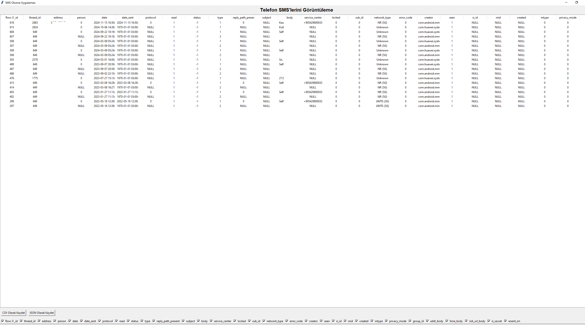
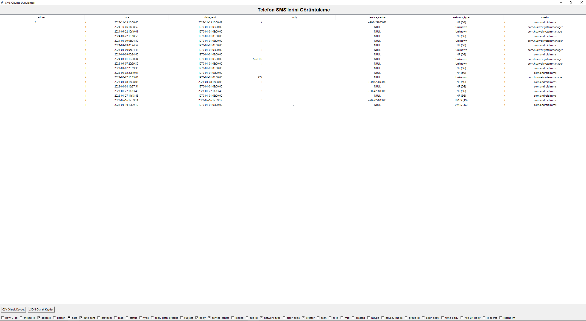

# SMS Okuma ve Görüntüleme Uygulaması

Bu uygulama, Android cihazınızdaki SMS'leri ADB (Android Debug Bridge) komutları ile okuyarak bir Tkinter tabanlı grafik kullanıcı arayüzü (GUI) üzerinde görüntüler. Ayrıca, SMS verilerini CSV ve JSON formatlarında dışarı aktarabilirsiniz.

## Gereksinimler

- Python 3.x
- ADB (Android Debug Bridge)
- Tkinter (Python ile birlikte gelir)
- `subprocess` ve `datetime` modülleri (Python ile birlikte gelir)

## Kurulum

1. **ADB Kurulumu:**
   ADB'yi bilgisayarınıza kurmanız gerekmektedir. ADB'yi [Android Developer](https://developer.android.com/studio) sitesinden veya sisteminizin paket yöneticisi aracılığıyla yükleyebilirsiniz.

2. **Python Modüllerini Yükleyin:**
   Python ortamınızda gerekli modüller zaten varsayılan olarak bulunmaktadır, ancak eksik olanlar için şunları yükleyebilirsiniz:
   ```bash
   pip install tk
   ```

3. **Cihaza ADB Bağlantısı Kurun:**
   Telefonunuzda geliştirici seçeneklerini açın ve USB hata ayıklama modunu etkinleştirin. Telefonu bilgisayarınıza bağlayarak ADB komutlarını kullanabilirsiniz:
   ```bash
   adb devices
   ```

4. **Uygulamanın Çalıştırılması:**
   Bu dosyayı çalıştırarak uygulamayı başlatabilirsiniz:
   ```bash
   python sms_reader_gui.py
   ```

## Kullanım

1. Uygulama başladığında, Android cihazınızdan SMS verileri okunacak ve bir tablo halinde görüntülenecektir.
2. Tabloyu sağ tıklayarak sütunları gizleyebilir veya gösterebilirsiniz.
3. SMS verilerini dışa aktarmak için:
   - **CSV formatında dışa aktarmak için:** `export_to_csv()` fonksiyonunu kullanabilirsiniz.
   - **JSON formatında dışa aktarmak için:** `export_to_json()` fonksiyonunu kullanabilirsiniz.

## Kod Açıklaması

- `read_sms()`: ADB komutları ile SMS verilerini okur ve işler.
- `format_network_type()`: SMS'lerdeki ağ türünü anlamlı bir formata dönüştürür.
- `show_sms_gui()`: Tkinter GUI'yi oluşturur ve SMS'leri bir tabloda görüntüler.
- `export_to_csv()`: SMS verilerini CSV formatında dışa aktarır.
- `export_to_json()`: SMS verilerini JSON formatında dışa aktarır.

## Dışa Aktarma

### CSV Formatında

SMS verilerini CSV formatında dışa aktarmak için `export_to_csv()` fonksiyonu kullanılır. Bu fonksiyon, SMS verilerini CSV dosyasına kaydeder.

### JSON Formatında

SMS verilerini JSON formatında dışa aktarmak için `export_to_json()` fonksiyonu kullanılır. JSON formatı, verilerin kolayca işlenebilmesini sağlar.

## Ekran Görüntüleri

### Ana Ekran


### Sütun Seçimi



